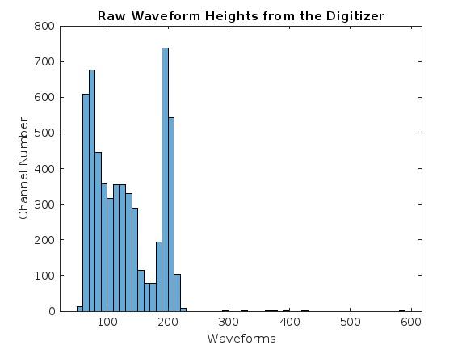
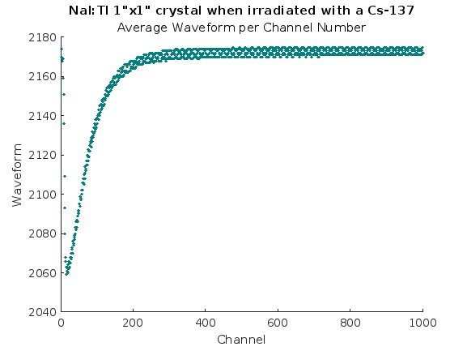
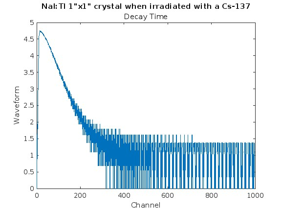
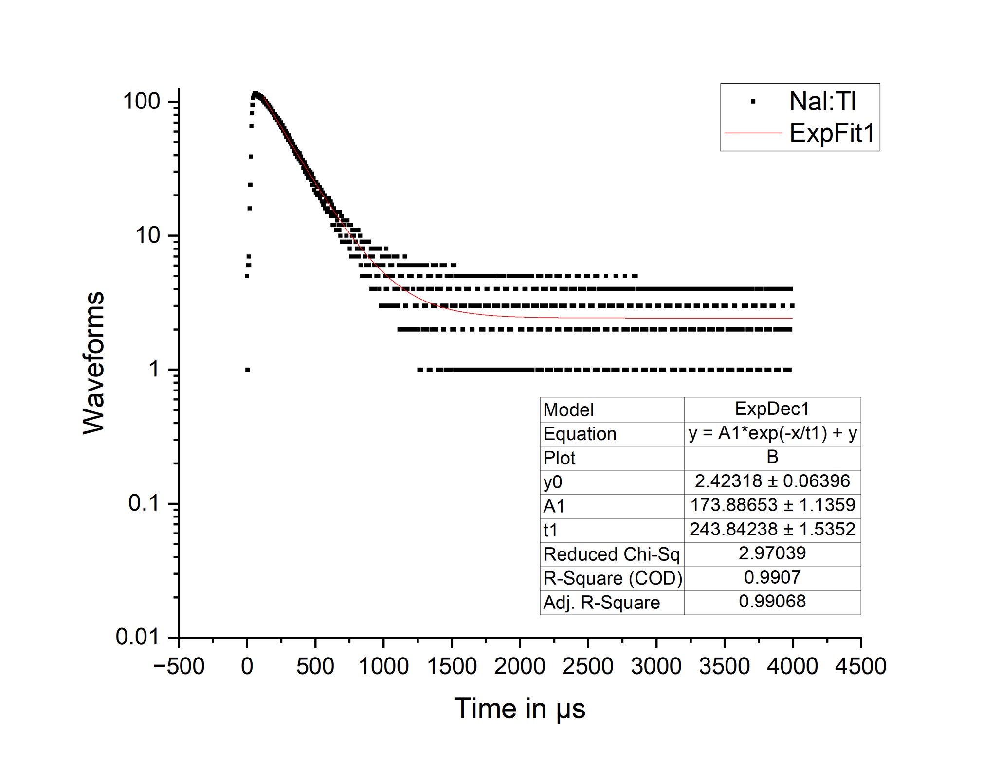

**Reshaping Matrices with Precision: A Dynamic Algorithm**

**Introduction:**
During my [internship at Fisk University](../Research/), I worked on a crucial challenge in data analysis – finding the decay time of light emitted when gamma-rays from cesium-137 interact with scintillator crystals. The raw data was collected in the form of an N x 2 matrix by connecting the anode from the photomultiplier tube (PMT) directly to the digitizer. To address the issue of reshaping matrices efficiently, I designed a dynamic algorithm that preserves data integrity.

**Understanding the Challenge:**
The fundamental challenge involved reshaping matrices with an N x 2 shape, where the first column represented channel numbers, and the second column contained energy spectra. The channel numbers were repeated based on the number of tests conducted. The goal was to extract the channel numbers and the number of consecutive repetitions while retaining the corresponding energy spectra. Manual adjustments and traditional resizing methods in Excel proved cumbersome and inefficient for each matrix. To overcome this, I developed a dynamic algorithm capable of intelligently adapting to the unique dimensions of any given matrix, streamlining the reshaping process.

1. **Finding Consecutive Numbers:** 
The `find_consecutive_numbers` function is a MATLAB function designed to identify consecutive sequences in the first column of a given matrix. It calculates the length of the first consecutive sequence and the total count of consecutive sequences. This information is crucial for determining the number of channel numbers in the data as well as how many tests were performed; this will tell us the size of the new matrix.

```MATLAB
function [consecutive_length, counts_of_tests] = find_consecutive_numbers(matrix)
    % This function finds the number of consecutive numbers in the first column of a matrix
    % then divides that number by the total number of elements of elements in that column.
    % In the event that it recieves an uneven data set, it will round down
    % to the even amount of divisable consecutive sets of first column
    % numbers
    
    % Extract the first column
    first_column = matrix(:, 1);
    
    % Find the number of elements in the first_column
    num_elements = numel(first_column);
    
    % Initialize vars to store the first consecutive sequence's length
    consecutive_length = 0;
    
    % Loop through the first_column to find the first consecutive sequence
    i = 1;
    while i < num_elements
        % Check if the next element is consecutive
        if first_column(i+1) == first_column(i) + 1
            % Count the length of the consecutive sequence
            count = 1;
            while i+1 <= num_elements && first_column(i+1) == first_column(i) + 1
                count = count + 1;
                i = i + 1;
            end
            % Store the length of the first consecutive sequence
            consecutive_length = count;
            break;
        end
        % Move to the next element
        i = i + 1;
    end
    
    % Calculate the number of times the consecutive sequence repeats
    % Then divides by the total to ensure an even number of data sets
    counts_of_tests = floor(num_elements / consecutive_length);
end
```

2. **Sorting and Reshaping:** With the new matrix size in hand, the algorithm reshapes the original matrix, accommodating its dimensions without distortion.

```matlab
%Sorting, reshaping, and determining the size of a matrix

% Replace the path name after the load fn with the path to your data
%load naitl/tlyc_mg2_11k_cs_2300404_001_wf_0.dat 
load naitl/naitl_1x1_001_wf_0.dat

% Replace the file name with the name of your file above
%Data = tlyc_mg2_11k_cs_2300404_001_wf_0
Data = naitl_1x1_001_wf_0

% Create the size of the new matrix using the find_consecutive_numbers() fn
[row_size, column_size] = find_consecutive_numbers(Data)

% Reshape the new matrix
new_matrix = reshape(Data(:, 2), row_size, column_size)

% Get the values of the (max - min) for each column
column_difference = max(new_matrix) - min(new_matrix)

% Add a new row at the top of the matrix with the values from above
% then sort each row ascending
data_matrix = [column_difference; new_matrix]
sorte_data_matrix = sort(data_matrix,2)

% Create a histogram of the first row of data
H = data_matrix(1,:)
histogram(H)
xlabel('Waveforms')
ylabel('Channel Number')
title('Raw Waveform Heights from the Digitizer')


% Find the average of each row
ignoringFirstRow = sorte_data_matrix(2:end,:);
mean_of_rows = floor(mean(sorte_data_matrix(2:end,:),2));

% Plott the Mean with the index values
column_to_plot = mean_of_rows(:,:);

row_indices = 1:size(mean_of_rows, 1);

figure;
scatter(row_indices,column_to_plot,  1, ...
            'MarkerEdgeColor',[0 .5 .5],...
            'MarkerFaceColor',[0 .7 .7],...
            'LineWidth',1.5);
xlabel('Channel');
ylabel('Waveform');
title('NaI:Tl 1"x1" crystal when irradiated with a Cs-137');
subtitle('Average Waveform per Channel Number');

% Get the inverted values of the mean then subtract the smallest value
% to get as close to 0 as possible, then plot
inverted = mean_of_rows*(-1);
zeroed = inverted - min(inverted)

% Plot decay time
plot(log(zeroed))
xlabel('Channel');
ylabel('Waveform');
title('NaI:Tl 1"x1" crystal when irradiated with a Cs-137');
subtitle('Decay Time');

% Create data file used to calculate actual decay time
writematrix(zeroed, 'zeroed_naitl.txt')
```

3. **Results-1:** We needed the height difference per channel in order to view the full energy spectra of the waveforms.



**Results-2:** We also needed to see the average wave form per channel.



**Results-3:** And finally, we needed to get a visual representation of how the decay time looked. I wasn’t able to calculate decay time in matlab due to time constraints, however, I plan to create another algorithm to find the decay time constants for each data set.



**Results-4:** In order to find the actual decay time, we had to plug the results of the algorithm into the [OriginPro](https://www.originlab.com/) software and use their exponential fit function to find the decay constant. As shown in the graph, the value of t1 shows a decay time of 244 microseconds; which is in the normal range for Nal:Tl.



**Conclusion:**
During my internship at Fisk University, I successfully solved a crucial problem in data analysis – reshaping matrices with varying shapes for calculating decay time. The algorithm I developed streamlines matrix manipulation, providing a seamless and adaptable solution. This experience has deepened my understanding of data analysis techniques and ignited my passion for pushing the boundaries of data science. Looking ahead, I am eager to continue exploring innovative solutions to complex problems in the dynamic field of data analysis.


