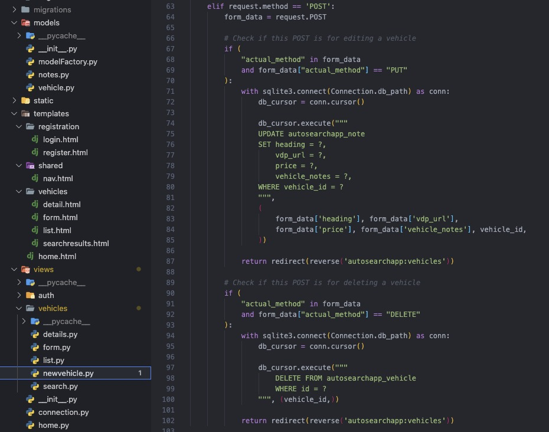

The objective of this Django project was to develop a streamlined solution for efficiently accessing a comprehensive inventory of cars for sale on the internet, without the need to sift through promoted vehicles and websites. Through the use of Python and Django's web templates, an interactive platform was created to interact with a SQLite database. Additionally, an external API was integrated into the application to facilitate data acquisition and storage in a proprietary database for future reference.

This project was undertaken as the capstone project during my studies at Nashville Software School, and serves as an exemplar of the core CRUD functionalities, allowing users to Create, Read, Update, and Delete data with ease. The app also incorporates secure login functionality to ensure user privacy.

The application features integration of MarketCheck's [API](https://www.marketcheck.com/apis), which utilizes automated crawlers to aggregate all available used car listings and makes them available through the API. The app retrieves this data and displays it using an HTML template that leverages Django's sophisticated [templating](https://docs.djangoproject.com/en/4.1/ref/templates/language/) engine. Through this project, I have gained a deeper understanding of the inner workings of Django, particularly its templating capabilities. Although the current implementation may not be aesthetically optimal, it provides a robust foundation upon which to build more advanced functionalities.

In future iterations, my aim is to further enhance the front-end experience by implementing a robust API layer and integrating it with a modern framework such as React. This would enable an even more streamlined user experience and improved scalability.

You can check out the github repo [here](https://github.com/MrNoIce/Auto-Search-App)

