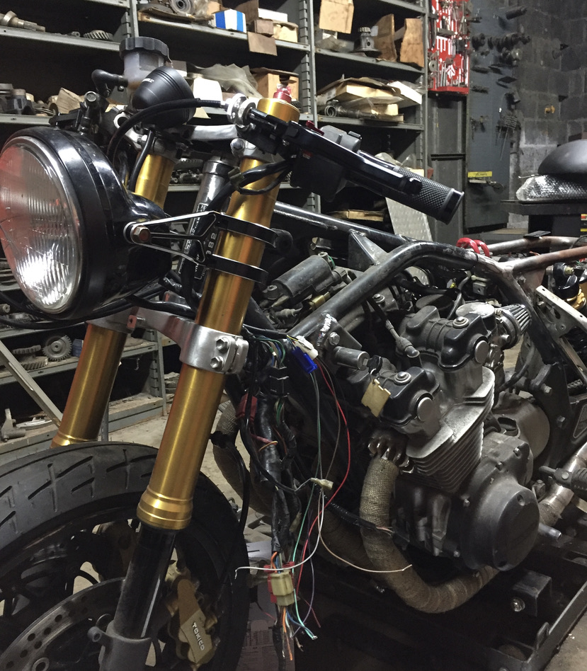
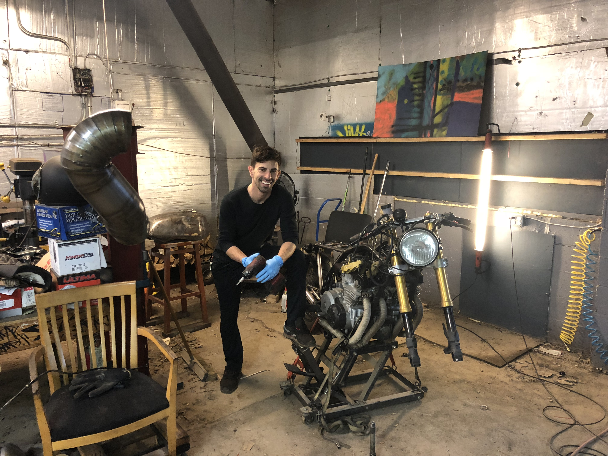
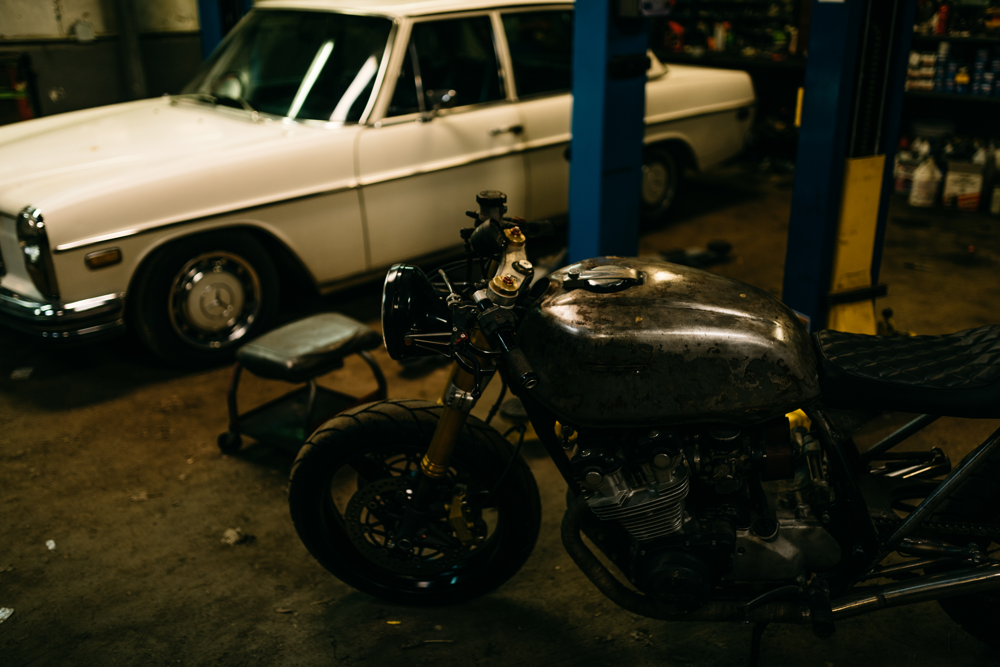
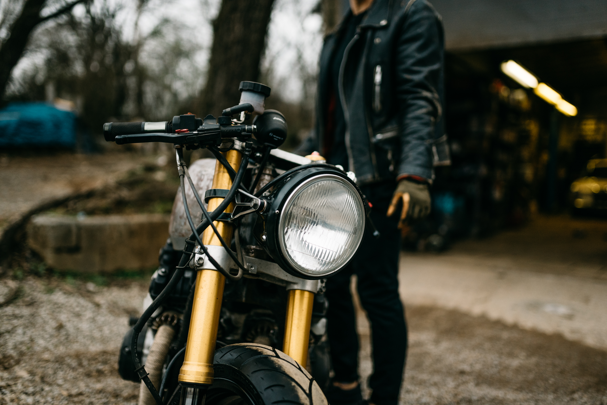

---

---

I always wanted to do a cafe racer build. I knew the Honda CB750 was a great choice, as it would have plenty of power and great support for the chassis. I found one on Craigslist and the seller and I agreed on a deal. The front end was bent from a wreck and the bike didn’t run, but the seller seemed trustworthy, so I took a chance on it. Fortunately, I had a gsxr front end laying around from a previous project that was never completed due to a bad engine, so I had the required parts to start the build. All I needed was the triple tree conversion spindle and a set of bearings to make it work with the frame, a little wiring for the controls and I’d be good to go. Alas, I was off on another build project. I already knew what I wanted it to look like so I got to work hacking away at the frame. I removed the rear triangle, bent a new seat hoop, made a battery tray, rewired the harness, swapped the cluster for an updated, all inclusive, single gauge and built a 4:2 exhaust. I wanted the look and top end power band of the filter pods, so I decided to fully rebuild the carbs and get them all balanced up. I found out the previous owner attempted the same thing and broke a few of the jets (I had a great time getting those out). After a few attempts with different jets, I was able to get it running smoothy, and let me tell you, the bike was incredibly fast and loud. I’m not a ‘true’ motorcycle enthusiast but I had a blast with the build. The bike turned into a glorified scooter, as I was too afraid to take it out on the interstate. The minimalistic, sleek style of a this cafe racer will forever hold a special place in my heart.

---

---

---

---

---

---

