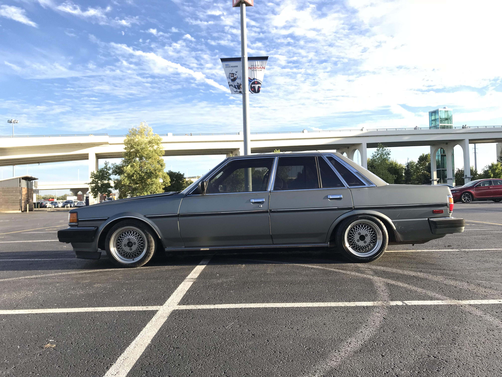
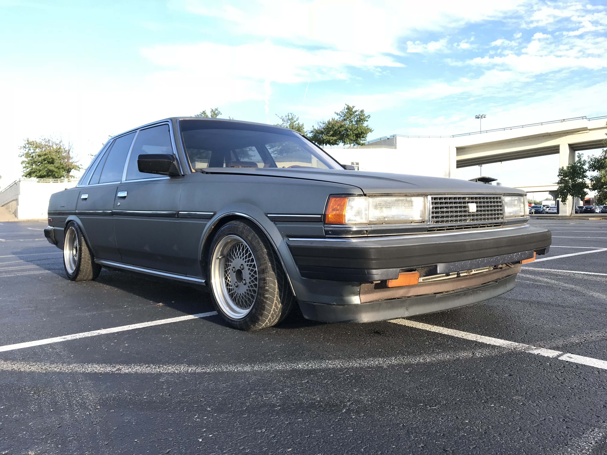
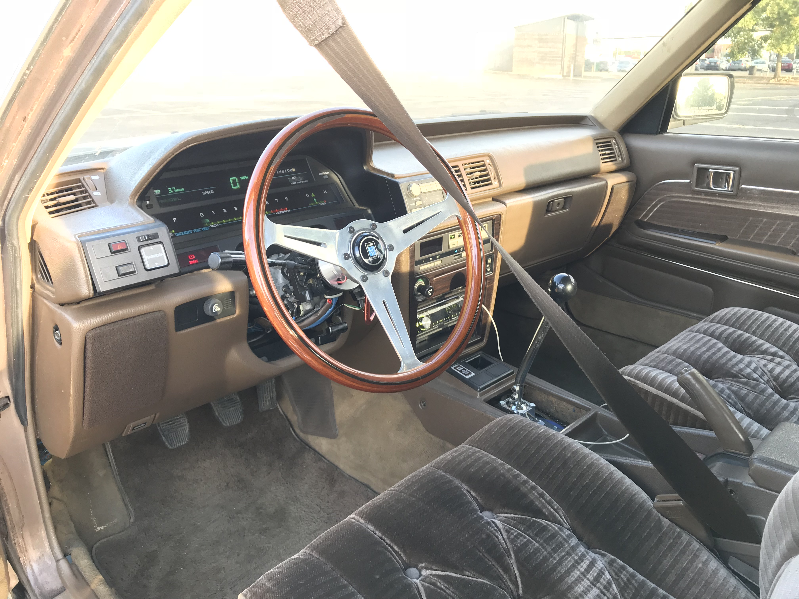
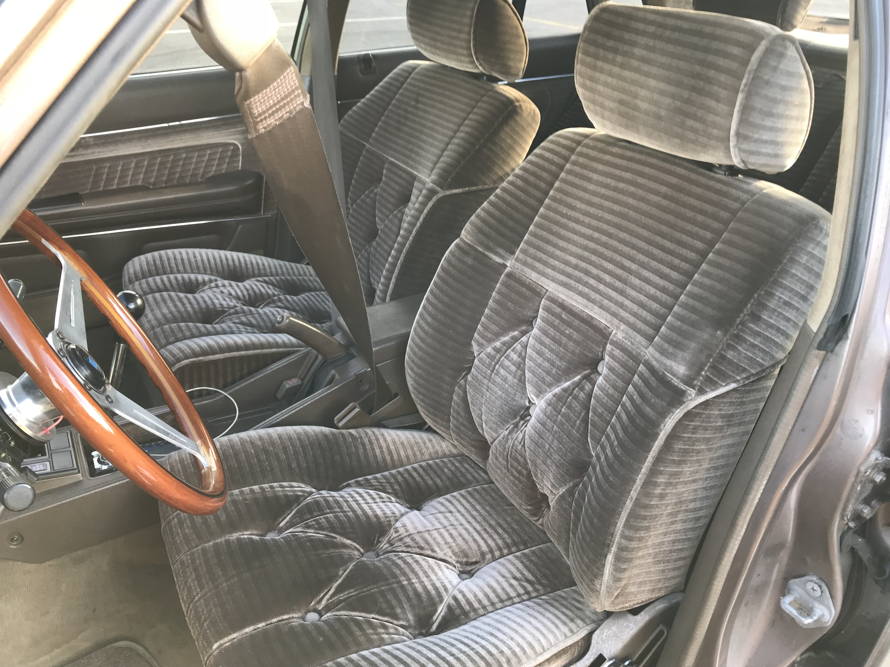
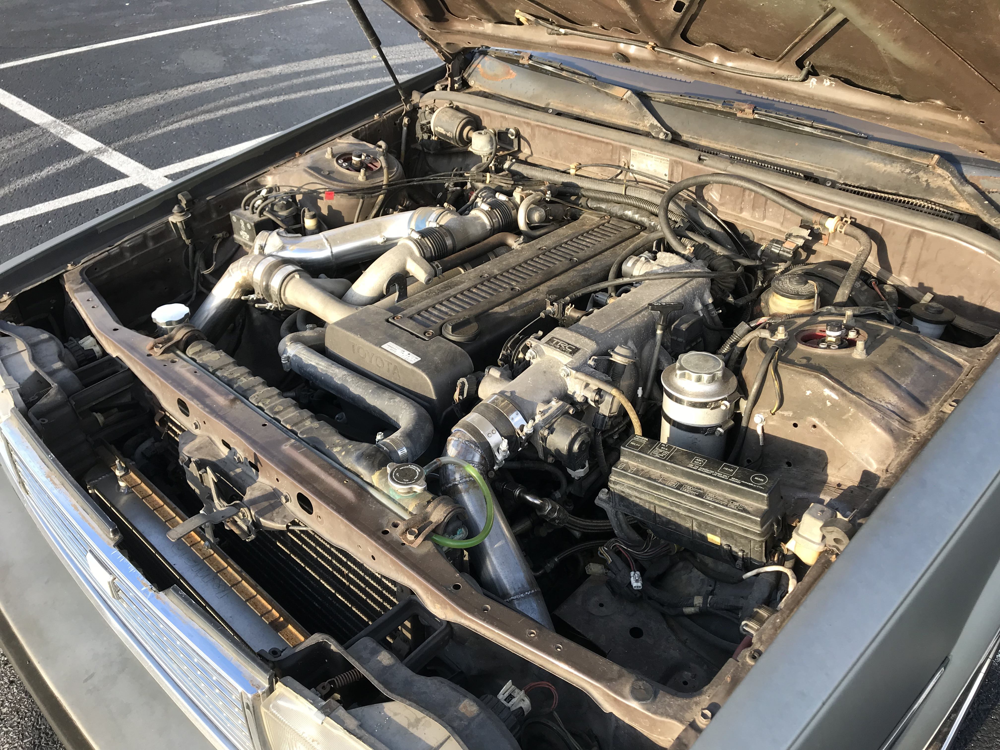

# The infamous MX73 Drift Missle

---

---

This build was quite possibly one of my favorite builds I had ever done.  The whole thing started by looking at a few [Cressidas](https://www.pinterest.com/andrewtamura/toyota-cressida-mx73/) online and one thing led to another- I found one in Florida, hopped on a plane the next day and drove it home. The car already had wheels and [coilovers](https://en.wikipedia.org/wiki/Coilover) on it, the chassis was super clean and the interior was in mint condition. I drove it with the automatic drivetrain for about a year but couldn't stop looking at swaps. I decided on the twin turbo [1JZ engine](https://en.wikipedia.org/wiki/Toyota_JZ_engine#1JZ-GE) due to its almost direct bolt in. All I needed to do was get a clutch pedal, build an exhaust, a massive amount of swap-parts and wire everything up. I also decided to go with an [AR5 transmission](https://en.wikipedia.org/wiki/Aisin_AR_transmission) due to the better design and cheap availability. The 1J bellhousing bolts right up and a drive shaft kit was already available from [driftmotion](https://www.driftmotion.com/product-p/dm3445.htm). Everything went in smoothly aside from a bit of massaging on the trans tunnel. I spent about a month getting it to run and all the gauges to work. There was very little support for wiring the engine into the MX73 chassis due to the 1J not being supplied in American vehicles.

With the help of my multimeter and many reviews of the Japanese wiring diagrams, I was finally able to get everything working. The only problem was it had a vibration at 80mph from the drive shaft that felt like the car would fall apart. It scared me when it would come in, and let me tell you, I've been in some scary [death-wobbling](https://www.youtube.com/watch?v=ncTgYl7P_TE&ab_channel=RarePartsInc) 4wd vehicles that rattled my shit. Anyways, after many driveshaft shop trips, two driveshafts, endless nights with a dial indicator checking runout, running the car on the lift and 2 transmissions, I determined it was a harmonics issue. The drive shaft was double U jointed and the slip was in the shaft. Both ends had adapter plates and were either too solid or there wasn't enough pitch to the rear end (although I went back and forth with a few manufactures and no one could figure out what could be causing it due to the high frequency of the vibration). I wound up going with the standard R154 transmission and driveshaft and all problems were solved. After about two years of messing around with this issue, I couldn't enjoy the car anymore. It was quite sad in hindsight, but it funded other projects for the shop after I sold it. I had a blast in that thing though- no trip was boring after ripping through second and third gear, breaking the tires loose around every corner.

---

---

---

---

---