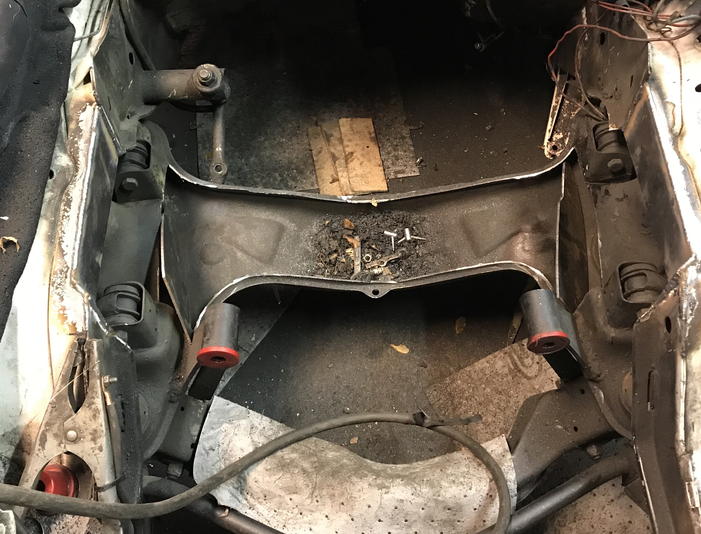
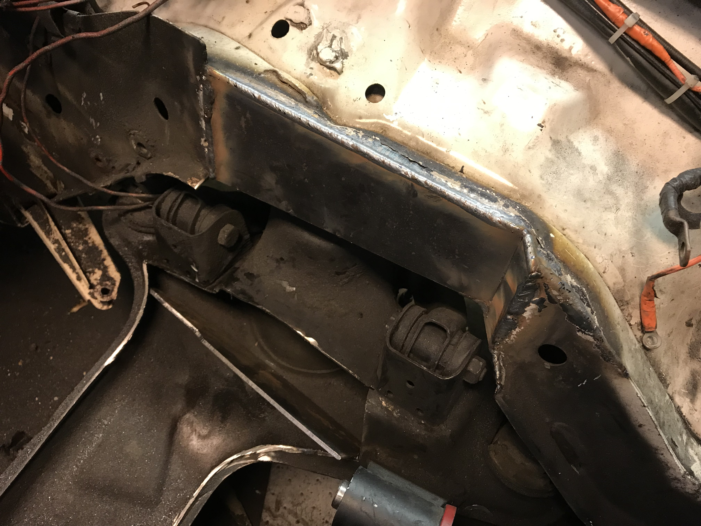
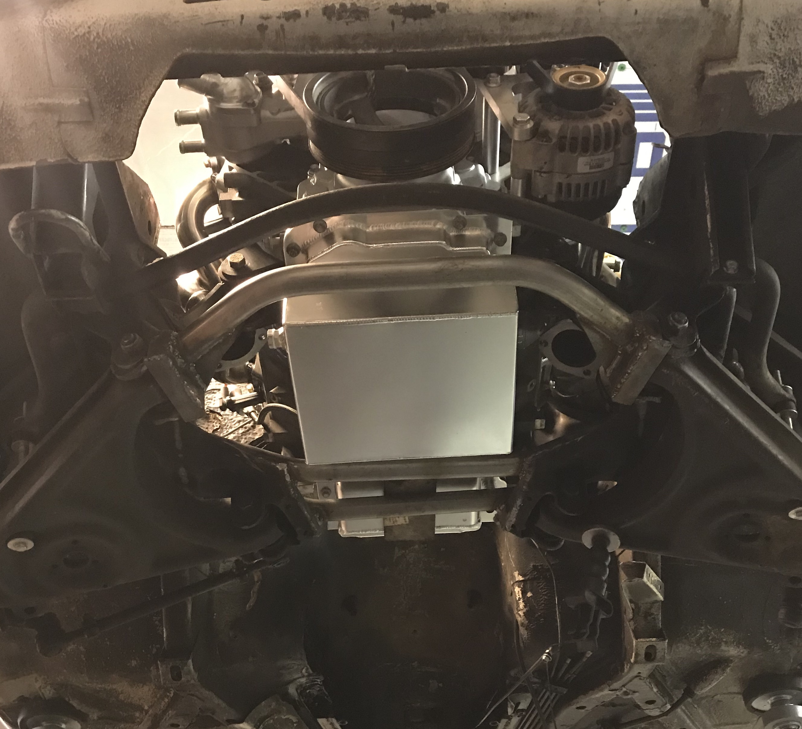
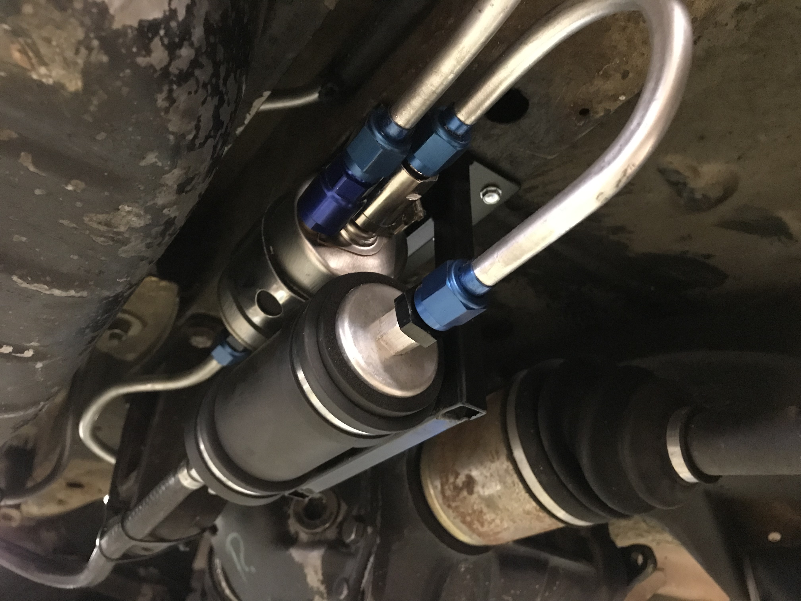
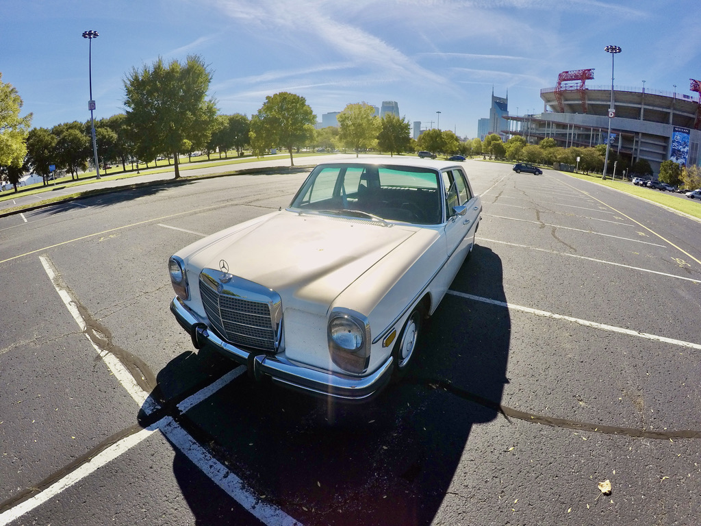
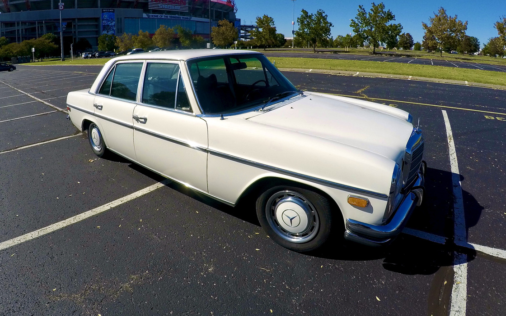

# LS powered W114 Cruiser

---
### The Build

I always had an eye for the W114 Mercedes chassis and when one came up for sale, I scooped it up once the owner dropped the price. The owner before him put in a carbureted chevy small block 305 which was terribly under powered, so naturally, that had to go. I decided to go with the classic aluminum [5.3L LS series chevy engine](https://en.wikipedia.org/wiki/General_Motors_LS-based_small-block_engine) due to its cheap and easy power output. The build was pretty straightforward - simple boltons, stock bottom end, 243 heads with a fresh mill and valve job, Texas speed 228R Cam, springs, and pushrod kit, ARP head studs, new OEM oil pump, front sump oil pan, LS6 intake, headers and a tune would bring the power of the car right to 420 horsepower. I had few initial hiccups due to some fitment issues with the swap around the steering linkage and gear box location. I was able to modify the steering link, notch the frame and inch on both sides to fit the headers, along with rerouting the exhaust to fit around the gear box in order to get the clearance I needed. The fuel pump was originally a mechanical fuel pump operated by the engine, however, I needed to supply the new engine with a constant feed of fuel from the old tank. This was executed through a returnless system with an external fuel pump operated by the computer. Once I had it up and running with a tune from [Boost Addicts](https://www.boostaddictstn.com/services#LSTUNNING), the car was driving like a dream.

---

---

---

---

---

---

---

<video controls className="video_container" >
  <source src="IMG_3401.MOV" type="video/mp4" />
</video>

---

 I drove it for a while after the build was completed and used it for a few friends' wedding getaway vehicles. It now has a new owner and they are loving every minute of it. Overall I had a blast with the build and am looking forward to my next project.

---

# Timelapse of the build process

<figure>
  <iframe width="1280" height="720" src="https://www.youtube.com/embed/19YgtSZUFa0" frameborder="0" allow="accelerometer; autoplay; clipboard-write; encrypted-media; gyroscope; picture-in-picture" allowfullscreen ></iframe>
</figure>

### And a short video I put together when I listed it for sale

<figure>
  <iframe width="1280" height="720" src="https://www.youtube.com/embed/761BoVGhYpo" frameborder="0" allow="accelerometer; autoplay; clipboard-write; encrypted-media; gyroscope; picture-in-picture" allowfullscreen></iframe>
</figure>
