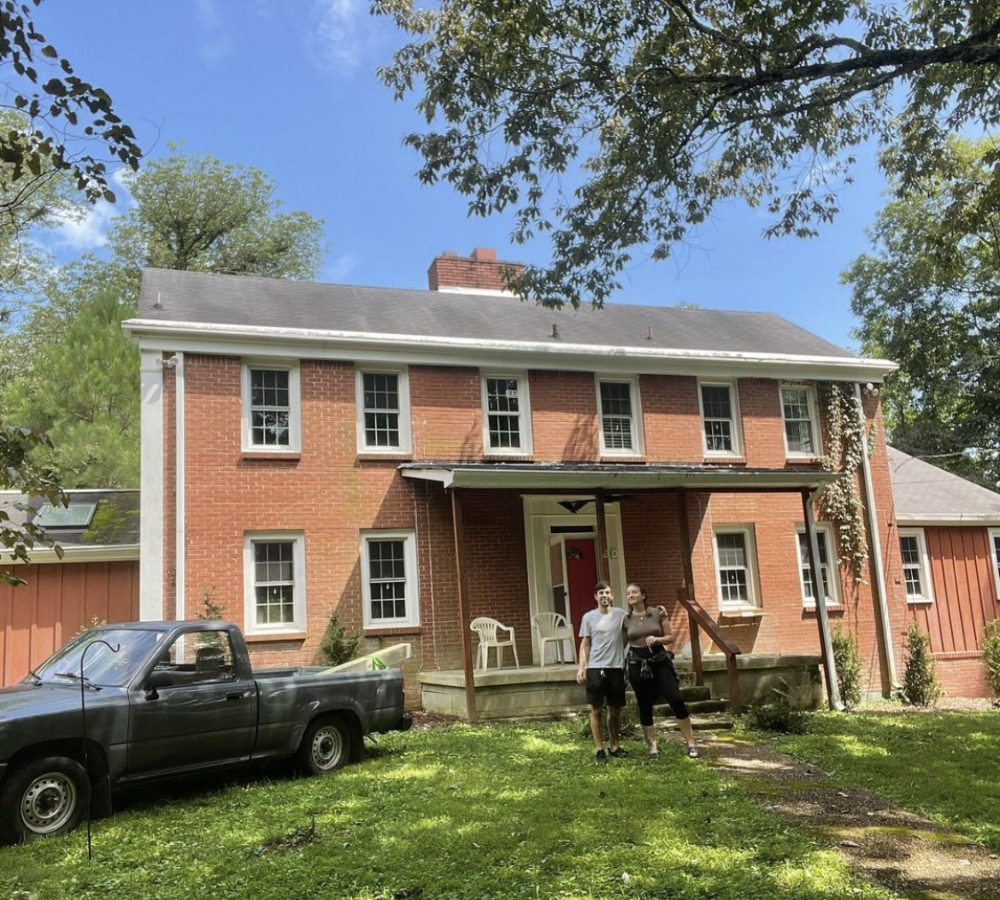

## Well - We got married, completed my second full-time semester of school, and bought another home with my wife; all within about a month.

We quickly started in and had to get the water-in-the-basment issue solved. We begun my trenching in a french drain on the north/left side
of the house and also trenched in gutter drains. We graded all the trenches out to the south side to daylight. Along with some grading in
the front and back, we finally solved the water issue.

Now onto the interior - The left side of the house had significant termite damage (the termites had been removed however the damage remained) and
needed repair of the main girder beam which was the next priority. I began by building support walls (also knows as cripple walls) between the main
floor and the floor above it. I then went underneath and started building my pads to put the bottle jack on. Once I had raised the girder off of the
support below, I was able to cut away the floor joists that connected to the girder. Once these were all cut back, I was then able to place in my 2X10s
on the front and back of the girder. I then ran bolts (all-thread) through it to tie it all together. Finally, I added joist hangers on all of the
cut-back floor joists to support the floor properly.

## Now onto the reorganization of the main floor

The downstairs bathroom wa