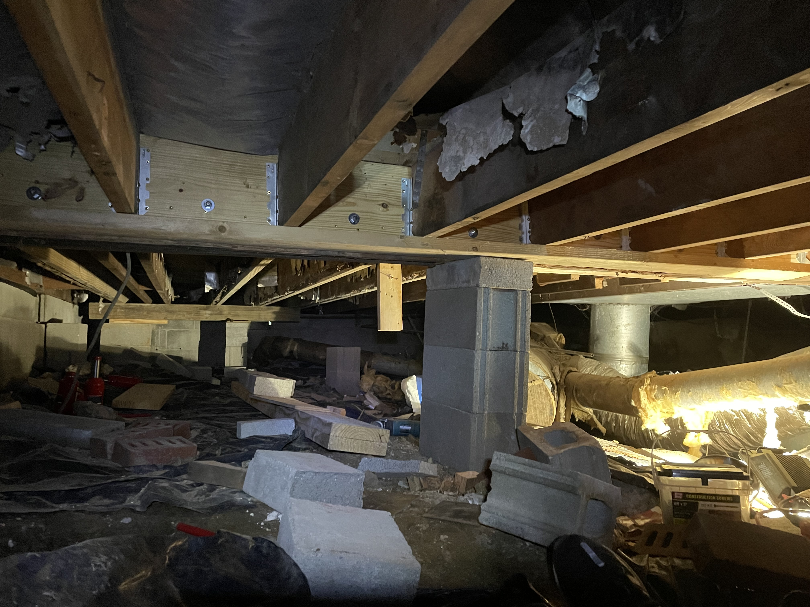

## Well - We got married, completed my second full-time semester of school, and bought another home with my wife; all within about a month.

The house is absolutely magnificent, however, it needed some serious attention.
We quickly started in and had to get the water-in-the-basment issue solved. We begun my trenching in a french drain on the north/left side
of the house and also trenched in gutter drains.
We graded all the trenches out to the south/right side to daylight. Along with some grading in
the front and back, we finally solved the water issue. (I know, water mitigation isn't that exciting)

Now onto the interior - The left side of the house had significant termite damage (the termites had been removed however the damage remained) and
needed repair of the main girder beam which was the next priority. I began by building support walls (also known as cripple walls) between the main
floor and the floor above it. I then went underneath and started building my pads to put the bottle jack on.

Once I had raised the girder off of the support below, I was able to cut away the floor joists that connected to the girder. Once these were all cut back, I was then able to place in my 2X10s
on the front and back of the girder. I then ran bolts (all-thread) through it to tie it all together. Finally, I added joist hangers on all of the
cut-back floor joists to support the floor properly.

## Now onto the reorganization of the main floor

The downstairs bathroom was non-existent. The individual we purchased the home from had installed a toilet in the downstairs bedroom in order to say it had a common bathroom.
So, the next order of business was to make the hallway that connects the main house to the master bedroom into the common bathroom and master closet. However,
that meant we would be cutting off our way into the master bedroom. Before we could get started on the common bath, we needed to cut in a new entry way into the master bedroom from the main
house.

---

---

---

Now that we have that finished, we were able to start on the common bath.

---

---

We needed to maximize the space needed for this small bathroom because we wanted it to be a full bath. In order to do so, we needed to build a curbless shower (which means
water proofing everything with [Kerdi](https://www.schluter.com/schluter-us/en_US/Membranes/Waterproofing-(KERDI)/Schluter%C2%AE-KERDI/p/KERDI) and sloping
the floor perfectly) as well as utilizing glass so it didn't feel cramped. Here is the final result.

---

---

Once we finished the common bath and entryway it was time for my next semester in obtaining my AS in mechanical engineering at Nashville State. I was taking Calculus II that
semester and was nervous about the difficulty. Fortunately I prevailed with it being my only B on my transcript in part due to having such a great teacher, Dr. Smith, but thanks to him.

After that semester was over, it was time to start on the most important room of the house, the kitchen. We had been cooking on a propane camping stove and washing the dishes
in a utility sink. Even though our set up was quite romantic, We are very happy to have an oven, counter space, and dishwasher.

---

---

---

---

---

