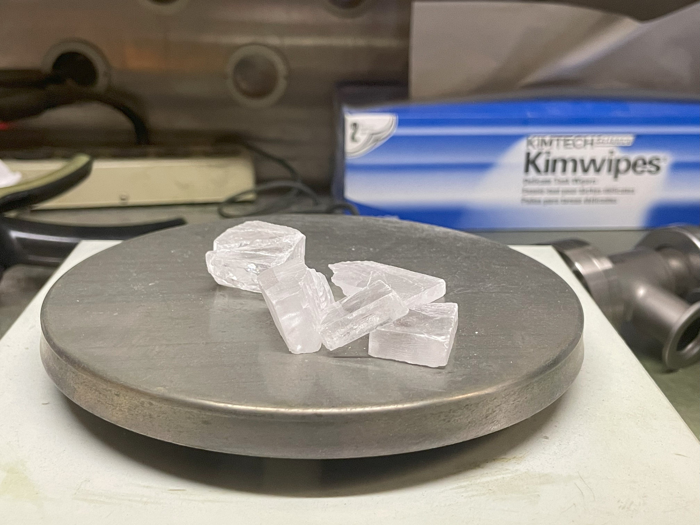
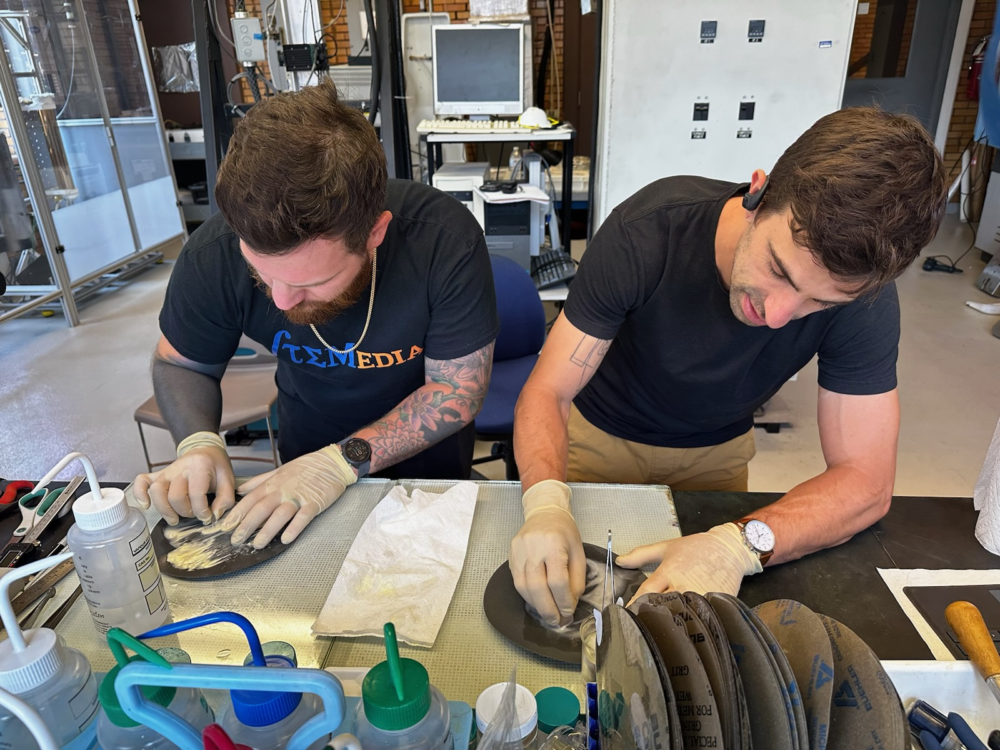
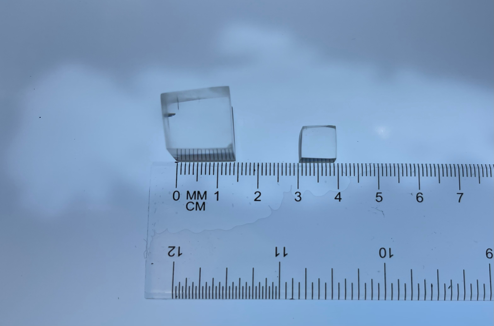
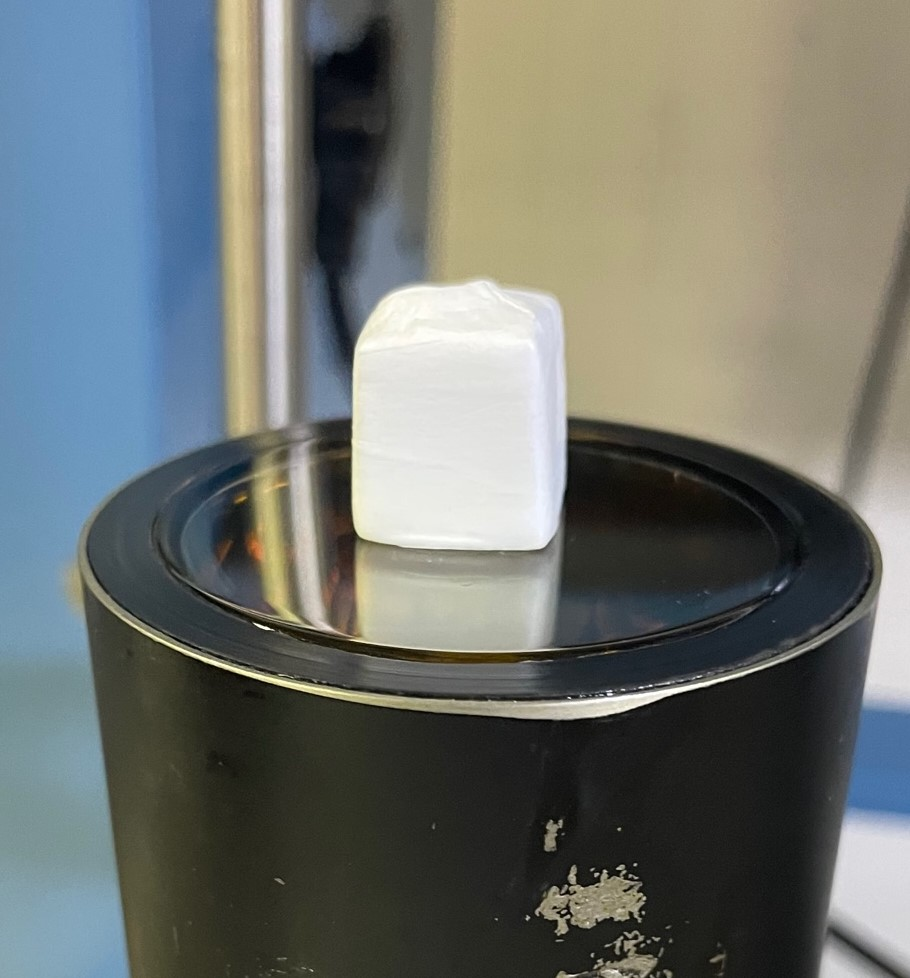
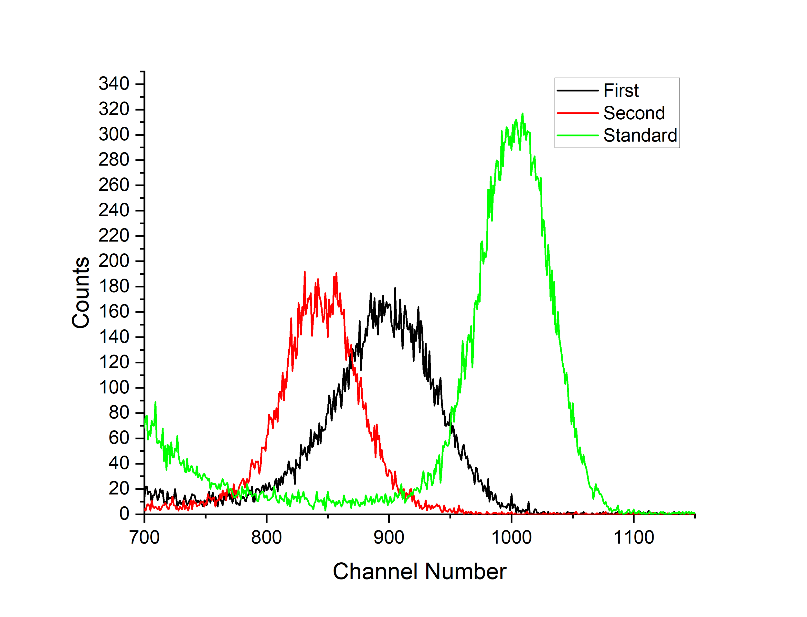
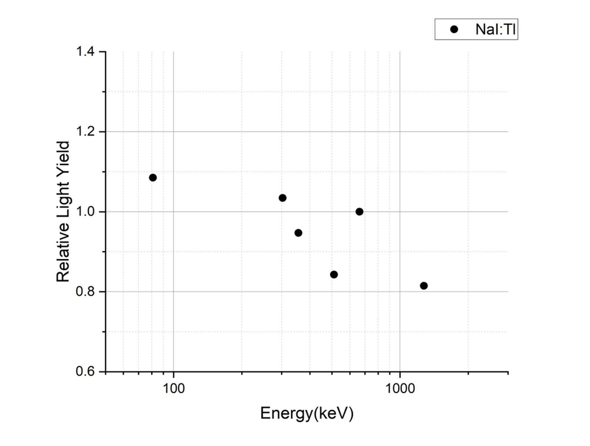
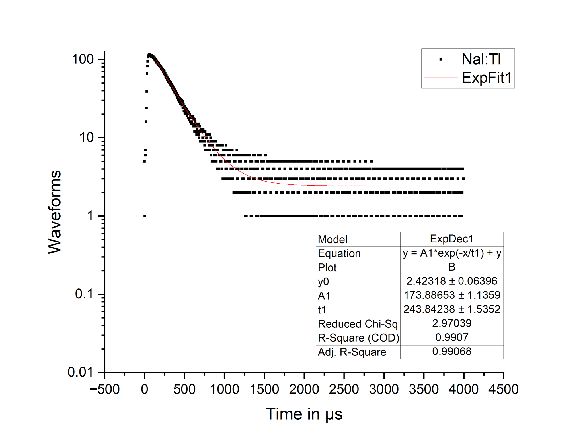

## Characterization of Nal:Tl Scintillator Crystals for Radiation Detection: Growth, Analysis, and Performance Evaluation

**Abstract**
Scintillators play a pivotal role in radiation detection across diverse industries, including medical imaging, space exploration, and homeland security. In this study, we focused on Nal:Tl scintillator crystals and their potential for optimal performance. Our research aimed to grow, characterize, and evaluate the scintillator crystals through various testing methods. Key characteristics, such as energy resolution, light yield, proportionality, and decay time, were analyzed to determine their efficiency in radiation detection applications. The results provide valuable insights into the development of superior scintillator compounds for a wide range of technological applications.

**Index Terms— Scintillators, Gamma Rays, Nal:Tl, Bridgman Method, Radiation Detection**

## I. Introduction
Scintillator crystals have been instrumental in radiation detection since their inception in the 1940s. With advancements in recent years, the need to identify scintillator compounds exhibiting high energy resolution, light yield, non-proportionality, and fast decay time has grown. The focus of this research is to characterize Nal:Tl scintillator crystals grown using the Bridgman method. Understanding their performance is crucial for advancing applications in medical imaging, space exploration, and homeland security.

## II. Experimental Methods

### A. Ampoules
To grow Nal:Tl scintillator crystals, Ge214-infused quartz glass ampoules were utilized, providing a high melting point ideal for the growth process. Ampoules were prepared by heating solid quartz tubes with an oxygen-hydrogen torch to form a long tip, cone, and base, which facilitated crystal seed formation.

**
The glass lathed used to form the cone tip of the ampules
**

**
After forming
**

**
Cone detail
**

### B. Bridgman Method
The Bridgman method involved gradually lowering the ampoules into an oven with varying heating zones. The melting point (600-700 degrees Celsius) facilitated the formation of crystal seeds, while the cooling zone (approximately 300 degrees Celsius) allowed for the crystalline structure's growth. Annealing relieved stresses within the crystals, ensuring optimal performance.

  

**
https://guedel.dcb.unibe.ch/research/hug_cry_movie.htm
**

### C. Material Preparation (Cutting, Polishing, and Wrapping)
Nal:Tl crystals, being hygroscopic, required careful handling in an inert environment. After cutting them into trapezoidal shapes using a diamond wire saw, the crystals were polished with descending grits of sandpaper to achieve a surface delta of 2-4 microns. To ensure maximum light yield, each crystal was wrapped in Teflon with a thickness of at least 1.04mm.

**
Nal:Tl before polishing
**

**
Jacob and I exercising our fingers
**

**
Final results
**

**
Teflon wrapped on PMT
**

## III. Results and Analysis

### A. Ideal scintillators
Energy resolution, light yield, non-proportionality, and decay time were essential characteristics assessed during the research. Energy resolution was determined using the Full Width Half Maximum (FWHM) of full energy peaks. Light yield was calculated by comparing the max heights of full energy peaks for the tested scintillator and a control. Non-proportionality was found by exposing the scintillator to various gamma energies and comparing the normalized data to a relative light yield of 1 from a cesium 137 source tested control. Decay time was measured in microseconds through oscilloscope analysis.

### B. Testing
The research employed a series of instruments, including the Ortec 556 High Voltage Power Supply, photomultiplier tubes coupled with optical grease, a Canberra model 2005 pre-amplifier, and an Ortec 671 amplifier. The signal was then fed to a Canberra Multiport 2 channel MCA, with a Tektronix TDS 380 oscilloscope providing a visual representation. Data analysis utilized OriginPro software and a custom [Matlab algorithm](../Algorithm/) to calculate decay time constants.

**
Testing equipment
**

### C. Nal:Tl Results
The initial test revealed a 10.3% resolution and 89% light yield, while the second test demonstrated an improved 8.3% resolution but a slightly reduced 84% light yield. Further investigations are required to understand the decline in light yield. The decay time of 241 microseconds aligned with typical Nal:Tl scintillators.

**
Results of light yeild and energy resolution
**

**
Results of non-proportionality
**

**
Results of decay time
**

## IV. Conclusions
The research contributes valuable insights into Nal:Tl scintillator crystals' performance for radiation detection. The characterized scintillators demonstrate potential for diverse technological applications. By identifying key parameters such as energy resolution, light yield, non-proportionality, and decay time, we pave the way for the development of superior scintillator compounds. These findings will drive advancements in medical imaging, space exploration, and homeland security technologies.

**ACKNOWLEDGMENTS**
The authors acknowledge the invaluable support provided by Fisk University, the US National Science Foundation (Grant No. HRD-2112556), and Defense Threat Reduction Agency Interaction of Ionizing Radiation with Matter University Research Alliance (DTRA IIRM URA) Cooperative Agreement (HDTRA1-20-2-0002). Any opinions, findings and conclusions or recommendations expressed in this material are those of the author(s) and do not necessarily reflect the views of Fisk University, the U.S. National Science Foundation, or Defense Threat Reduction Agency. We extend our gratitude to Dr. R. Hawrami, Dr. E. Ariesanti, Dr. L. Matei, and Dr. A. Burger from [Fisk University][def], as well as Dr. Bir Bohara from [Nashville State Community College](https://www.nscc.edu/news/research-summer-for-nashville-state-stem-group.php), for their guidance and assistance during this research.

**REFERENCES**  
[1] C.D. Zerby, A. Meyer, R.B. Murray,
Intrinsic line broadening in NaI(Tl) gamma-ray spectrometers,
Nuclear Instruments and Methods,
Volume 12,
1961,
Pages 115-123,
ISSN 0029-554X,
https://doi.org/10.1016/0029-554X(61)90119-7.  

[def]: https://www.fisk.edu/bioss/