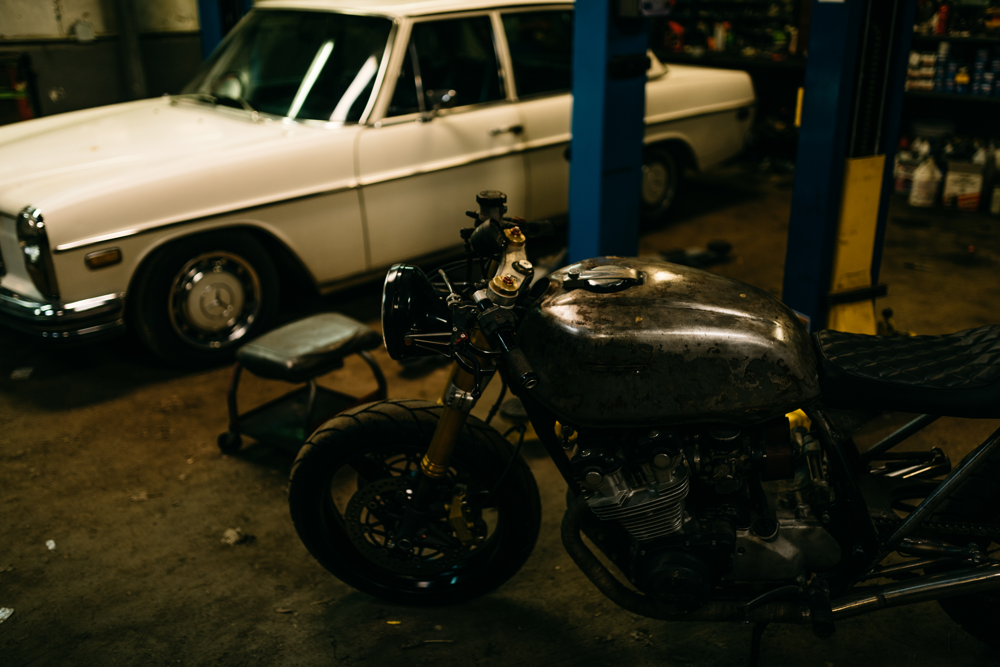

# How can I help you with your project?

---

# I specalize in weird swaps. LS series, 2JZGTE, 1JZGTE, K-Series, B-series, Honda, and many other computer controlled engine.

## I come to you and diagnose your vehicle. My expertise is in determining the issues and guiding you in how to solve them. I will, however, do small repairs as a I see fit. I can provide you with a detailed plan of your project's needs and I will work with you on an ongoing project if needed.

 - Please provide a fully detailed write up of your vehicle ***and*** the physical space it is in
 - List any known issues, work previously done to it, and what you have done so far
 - I will travel up to 30 miles from Nashville - Any further will need to be discussed

## Please fill out the service request form below and I will get back to you in a timly manner

[Vehicle Service Request Form](/Request)